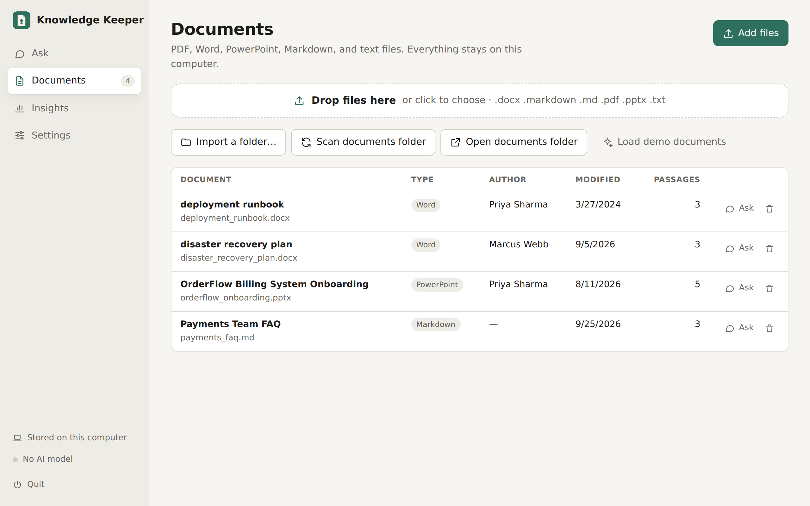
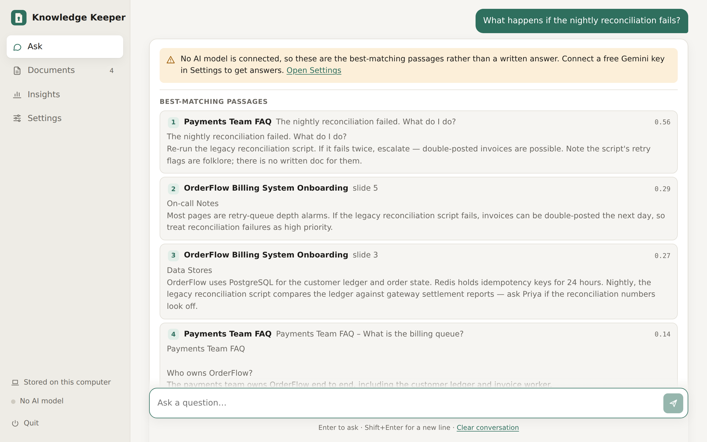
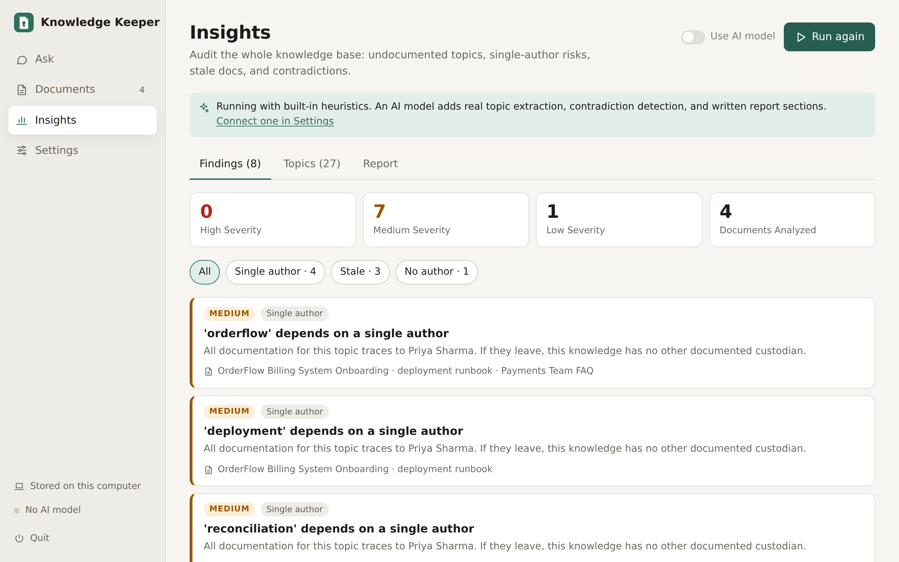

# knowledge-keeper

[](https://github.com/michaelusher/knowledge_keeper/actions/workflows/tests.yml)

Knowledge preservation for organizations: ingest training documents, PowerPoints, PDFs, and runbooks into a RAG knowledge base that supplements an LLM — then go further and **generate system documentation from the corpus and surface gaps, risks, and contradictions** in what your organization has written down.

It runs as a **local website**: a React app in your browser on top of the Python engine, launched from your app menu like any desktop program. A full command-line interface is still there for scripting.



Two systems share one ingestion pipeline:

1. **RAG assistant** — ask questions, get answers grounded in your documents with citations back to the exact slide/page/section. Scope a question to one document or several.
2. **Analysis layer** — a corpus-wide knowledge map that powers gap analysis (undocumented topics, bus-factor risk, stale docs, conflicting procedures) and a generated Markdown system report.

Runs against **Azure** (AI Search + Azure OpenAI), **AWS** (OpenSearch Serverless + Bedrock), or fully **offline on your computer** — same code, one setting.

```
   Browser (React app)            kk CLI
   Ask · Documents · Insights     ingest · ask · analyze · report
   · Settings                          │
          │  /api (FastAPI, localhost) │
          ▼                            ▼
   ┌──────────────────────────────────────────────────┐
   │ service layer: workspace, background jobs,       │
   │ settings, API-key store                          │
   └──────────────────────┬───────────────────────────┘
                          ▼
   pptx docx pdf md ─▶ INGESTION: extract → chunk (section-aware) → embed
                        preserves author, dates, slide/page locations
                          ▼
                  VECTOR STORE (hybrid search, per-document filter)
                  Azure AI Search │ OpenSearch │ local
                     ▼                         ▼
            RAG: cited answers        ANALYSIS: knowledge map
                                      → gaps / bus factor / staleness
                                      → contradictions → report (md)
```

## Install and open

Works on **Windows, macOS, and Linux** — the test suite runs on all three on every push (see the badge above). You need Python 3.10 or newer. Node.js is **not** needed to run the app; the built React frontend ships inside the package.

Setup is the same shape everywhere: get the code, install it once with [pipx](https://pipx.pypa.io), run `kk-gui`, then add a shortcut so you never need the terminal again.

### 1. Get the code

Either:

- **Download:** on the [GitHub page](https://github.com/michaelusher/knowledge_keeper), click **Code → Download ZIP** and unzip it. The folder is named `knowledge_keeper-main`.
- **Clone:** `git clone https://github.com/michaelusher/knowledge_keeper.git` (creates a folder named `knowledge_keeper`).

Put the folder somewhere permanent, such as **Documents**, not Downloads — the installed app runs from this folder, so moving or deleting it breaks it. In the steps below, replace the `cd` path with wherever yours is; it's the folder that contains `pyproject.toml`.

### 2. Install and open — Windows

1. Install **Python** from https://python.org/downloads. On the first installer screen, check **"Add python.exe to PATH"** — skipping this is the most common reason setup fails.
2. Open **PowerShell** (Start menu → type "PowerShell") and run:
   ```powershell
   py -m pip install --user pipx
   py -m pipx ensurepath
   ```
3. **Close PowerShell and open a new window** (so it picks up the new PATH), then:
   ```powershell
   cd $HOME\Documents\knowledge_keeper-main
   pipx install -e .
   kk-gui
   ```
4. Your browser opens Knowledge Keeper. Click **Settings → Add to Start menu**.

From now on, open **Knowledge Keeper** from the Start menu. `kk-gui` prints nothing on Windows — that's normal; use `kk gui` (with a space) if you want to see its output. If Windows' "Extract All" created a folder inside a folder, `cd` one level deeper.

### 2. Install and open — macOS

1. Install **Homebrew** if you don't have it: follow the one-line command at https://brew.sh.
2. Open **Terminal** (Spotlight → type "Terminal") and run:
   ```bash
   brew install pipx
   pipx ensurepath
   ```
3. **Close Terminal and open a new window**, then:
   ```bash
   cd ~/Documents/knowledge_keeper-main
   pipx install -e .
   kk-gui
   ```
4. Your browser opens Knowledge Keeper. Click **Settings → Add to Applications**.

From now on, open **Knowledge Keeper** from Launchpad or Spotlight. If Homebrew's pipx can't find Python, run `brew install python` first. Apple Silicon and Intel Macs both work.

### 2. Install and open — Linux

Install pipx for your distribution:

```bash
sudo dnf install pipx                                           # Fedora / RHEL
sudo apt update && sudo apt install -y pipx python3-venv        # Ubuntu / Debian / Mint / Pop!_OS
sudo pacman -S python-pipx                                      # Arch / Manjaro
pipx ensurepath
```

Open a **new terminal**, then:

```bash
cd ~/Documents/knowledge_keeper-main
pipx install -e .
kk-gui
```

Your browser opens Knowledge Keeper. Click **Settings → Add to app menu**, and from now on open it from your app launcher (Activities on GNOME, the app menu on KDE and others).

- On Ubuntu/Debian, `python3-venv` must be installed explicitly — without it pipx fails with a cryptic ensurepip error. On Ubuntu 22.04 and older, if the packaged pipx misbehaves, use `python3 -m pip install --user pipx`.
- **Chromebook:** in ChromeOS Settings, search for **Linux** and turn on the Linux development environment, then follow the Ubuntu/Debian steps in its terminal.

### Phones and tablets

iPhone, iPad, and Android can't install Knowledge Keeper, but they can use one running on your computer: start it with `kk-gui --share` and open the address it shows (see [Use it from another device](#use-it-from-another-device)).

### Updating, stopping, and uninstalling

- **Update:** replace the folder's contents with the new version (download again, or `git pull`), then run `pipx install --force -e .` in that folder.
- **Stop:** click **Quit** at the bottom of the sidebar. Opening the app while it's already running just reopens the browser tab.
- **Uninstall:** `pipx uninstall knowledge-keeper`. Your documents and settings stay in the workspace folder below until you delete it.

## Where your data lives

Everything for your knowledge base lives in one **workspace** folder, `~/KnowledgeKeeper` by default:

```
~/KnowledgeKeeper/
  documents/     files you add through the app (you can also copy files in and click "Scan documents folder")
  reports/       generated Markdown reports
  kk_data/       indexes and analysis results, one folder per backend
  config.yaml    settings written by the Settings page (never contains API keys)
```

On Windows that's `C:\Users\<you>\KnowledgeKeeper`. Saved API keys are kept separately, outside the workspace — see [Connect a free AI model](#connect-a-free-ai-model-gemini).

Use `kk-gui --workspace PATH` for a different one — e.g. one workspace per team or project.

**Platform notes**

- **Windows:** with `--share`, Windows Firewall asks whether to allow Python on your network — allow it on *private* networks only. The network address and access code appear under **Settings → This computer**, since `kk-gui` prints nothing on Windows. The Start-menu shortcut uses the Python icon.
- **macOS:** the first time you import a folder from Documents, Desktop, or Downloads, macOS asks for permission — allow it. The Applications shortcut uses a generic icon. The default shell is zsh, so if you set keys in your shell use `~/.zshrc`.
- **Linux:** the app-menu launcher is `~/.local/share/applications/knowledge-keeper.desktop`.
- Any modern browser works: Chrome, Edge, Firefox, Safari 15.4+.

## A two-minute tour

1. **Documents** — drag files onto the window (PDF, Word, PowerPoint, Markdown, text), or **Import a folder** to index files where they are. **Load demo documents** adds four sample files with planted problems. Each row has **Ask** (question just that document) and **Remove**.
2. **Ask** — type a question. With an AI model connected you get a written answer where every claim carries a numbered citation; click one to read the exact passage with its author and date. Without a model you get the best-matching passages. **Searching: All documents** at the top narrows the search to the documents you pick.
3. **Insights** — **Run analysis** maps what the corpus covers and lists findings by severity. The **Report** tab generates a shareable Markdown report.
4. **Settings** — connect an AI model, choose where the knowledge base is stored, add the app-menu shortcut.

| Ask | Insights |
|---|---|
|  |  |

_Screenshots from the demo documents with no AI model connected; with one, Ask shows a written answer with numbered citations._

## Connect a free AI model (Gemini)

Without an AI model, questions return matching passages and analysis uses built-in heuristics. Google's Gemini free tier (no credit card) adds written, cited answers, real topic extraction, contradiction detection, and written report sections:

1. Get a key at https://aistudio.google.com/apikey (it starts with `AIza`).
2. In the app: **Settings → AI model → Google Gemini**, paste the key, keep **Remember on this computer** checked, **Save**, then **Test connection**.

Saved keys go in a per-user file with owner-only permissions — `~/.config/knowledge-keeper/keys.env` on Linux, `~/Library/Application Support/knowledge-keeper/keys.env` on macOS, `%APPDATA%\knowledge-keeper\keys.env` on Windows — never in the project folder, `config.yaml`, or anything git uploads. A `GEMINI_API_KEY` set in your shell environment takes priority over a saved one. Never paste keys into chats or documents; if one leaks, rotate it at aistudio.google.com.

**Free-tier realities** (learned the hard way):
- **Models get retired.** If you see `404 ... no longer available`, the error names the successor — change **Model** in Settings. The default is `gemini-3.6-flash`.
- **Capacity spikes happen.** On `503 UNAVAILABLE` the app retries automatically with backoff and shows progress. If the model still fails, questions fall back to matching passages instead of erroring out; try again in a few minutes.

## Use it from another device

```bash
kk-gui --share
```

Also serves the app on your local network and shows an address and a one-time **access code** (printed in the terminal, and under **Settings → This computer**). On a phone, tablet, or another computer on the same Wi-Fi, open the address in the browser and enter the code — nothing needs installing on that device. Visitors can ask questions, add documents, and run analysis; settings, API keys, folder import, and shutdown stay restricted to the computer running it. Without `--share` the app only listens on `127.0.0.1`, so nothing outside your computer can reach it.

## Working with your own documents

Notes that save head-scratching:
- **Adding never replaces.** Every document stays searchable until you remove it. To focus on one document, use **Ask** on its row (or the **Searching** picker) instead of removing the others.
- **PDFs must contain real text.** Digitally created PDFs work; scanned ones extract nothing and show 0 passages with a warning icon. Run them through OCR first — `ocrmypdf in.pdf out.pdf` (Fedora: `sudo dnf install ocrmypdf`; Ubuntu/Debian: `sudo apt install ocrmypdf`; macOS: `brew install ocrmypdf`; Windows: easiest via WSL). Quick test: if you can select text in a PDF viewer, it will index.
- **Single-document knowledge bases analyze flat.** Most findings compare documents against each other; expect them once several related documents are indexed.
- **Answers report what the documents say, not what is true.** Read the citations as provenance — fringe sources get faithfully summarized, and "the passages don't address this" is a correct answer, not a failure.
- The offline search matches vocabulary, not meaning — phrase questions with the document's own words if results look off.

## Frontend development

The React app lives in `frontend/` (Vite, React 19, plain JavaScript, no UI libraries). The Python server serves its production build from `src/knowledge_keeper/web/static/`. To work on it (Node.js 20.19+):

```bash
kk-gui --no-browser            # terminal 1: the Python API on :8765
cd frontend && npm install
npm run dev                    # terminal 2: http://localhost:5173 with hot reload, /api proxied to :8765
npm run build                  # writes the production build into src/knowledge_keeper/web/static
```

Commit the rebuilt `web/static` files along with your source changes, so people installing from the repo never need Node. The API is documented at `http://127.0.0.1:8765/api/docs` while the app is running.

## Switching between local, Azure, and AWS

In the app: **Settings → Where the knowledge base lives**. From the terminal, three ways, in order of precedence:

```bash
kk -p azure ask "How does failover work?"   # one-off: -p/--provider flag on any command
kk use aws                                  # persistent: sets the default for all future commands
# lowest precedence: provider: in config.yaml / KK_PROVIDER env var
```

`kk status` shows which backend is active, whether its dependencies are installed and its
config filled in, and how many documents each backend has ingested:

```
Active provider: aws  (set via `kk use aws`)

│ Provider │ Dependencies              │ Configured │ Ingested docs │
│   local  │ installed                 │ yes        │ 4             │
│   azure  │ pip install -e '.[azure]' │ no         │ —             │
│ ▶ aws    │ installed                 │ yes        │ —             │
```

Each backend's state (ingestion manifest, document registry, knowledge map, and the local
vector store) is isolated under `kk_data/<provider>/`, so switching never cross-contaminates:
a freshly configured cloud backend starts empty and `kk ingest` correctly re-indexes everything
into it, while your local experiments stay intact. A typical flow: develop everything against
`local` for free, then `kk use azure && kk ingest ./docs` to populate the real deployment —
and `kk -p local ask ...` any time to compare.

## CLI

All app features are also available from the terminal. Run CLI commands from a workspace folder
(`cd ~/KnowledgeKeeper`) to share the app's knowledge base — the CLI uses whatever folder it's run from.

| Command | What it does |
|---|---|
| `kk gui` / `kk-gui` | Open the web app (`--share`, `--workspace PATH`, `--no-browser`, `--install-shortcut`). |
| `kk use <provider>` | Set the default backend (local / azure / aws). Persists across commands. |
| `kk status` | Show active backend, dependency/config readiness, per-backend document counts. |
| `kk ingest <dir>` | Walk a directory, extract/chunk/embed/index all supported files. Incremental: unchanged files (by SHA-256) are skipped; changed files are re-indexed. |
| `kk ask "<question>"` | Hybrid retrieval + LLM answer with inline `[S1]` citations resolving to document + slide/page/section. |
| `kk analyze` | Build the knowledge map (topics × documents × authors × freshness) and run all gap-analysis passes. Writes `kk_data/knowledge_map.json`. |
| `kk report -o out.md` | Generate the system report: inventory, coverage matrix, LLM-synthesized per-topic documentation (with attribution), and all findings. |
| `kk remove <filename>` | Drop one document from the index (partial filename match). |
| `kk serve` | FastAPI server: `/ask`, `/ingest`, `/analyze`, `/findings`, `/topics`, `/documents`, `/report`, `/healthz`. |

## What the gap analysis finds

| Finding | Signal | Why it matters |
|---|---|---|
| **gap** | Topic referenced ≥ N times across docs but explained nowhere | The knowledge exists only in people's heads |
| **bus_factor** | All docs covering a topic trace to ≤ 1 author | One departure loses the documented custodian |
| **stale** | Newest covering doc older than a cutoff (default ~18 months) | Docs may no longer match the system |
| **single source** | Topic documented in exactly one file | No redundancy; one file rots, topic is gone |
| **conflict** (LLM) | Multiple docs give contradictory procedures/owners/values | Someone will follow the wrong one during an incident |
| **orphan** | Document has no author metadata | Nobody to ask when it stops making sense |

Heuristic passes always run. With an LLM configured, topic extraction becomes semantic (systems vs. procedures vs. roles, *mentioned* vs. *explained*) and conflict detection activates. Thresholds live in `config.yaml → analysis`.

## Deploying on Azure

1. **Provision** — `infra/azure/main.bicep` deploys Azure AI Search (semantic ranker enabled) + Azure OpenAI with `text-embedding-3-large` and `gpt-4o` deployments:
   ```bash
   az group create -n kk-rg -l eastus2
   az deployment group create -g kk-rg -f infra/azure/main.bicep -p namePrefix=kkprod
   ```
2. **Grant access** — assign your identity (or the app's managed identity) `Search Index Data Contributor` on the search service and `Cognitive Services OpenAI User` on the OpenAI account. Leave API keys empty in config to use `DefaultAzureCredential`.
3. **Configure**:
   ```yaml
   provider: azure
   llm: { provider: azure_openai }
   azure:
     search_endpoint: https://kkprod-search.search.windows.net
     openai_endpoint: https://kkprod-aoai.openai.azure.com
   ```
4. `pip install -e ".[azure]"` then `kk ingest <dir>` — the index is created automatically with vector + keyword + semantic-ranker hybrid search.

## Deploying on AWS

1. **Provision** — `infra/aws/main.tf` creates an OpenSearch Serverless VECTORSEARCH collection with encryption/network/data-access policies, plus an IAM policy for Bedrock invocation:
   ```bash
   cd infra/aws && terraform init
   terraform apply -var name_prefix=kkprod -var principal_arn=arn:aws:iam::<acct>:role/<runner-role>
   ```
2. **Enable models** — in the Bedrock console (once per account/region), enable *Titan Text Embeddings V2* and your Claude model under Model access.
3. **Configure**:
   ```yaml
   provider: aws
   llm: { provider: bedrock }
   aws:
     region: us-east-1
     opensearch_endpoint: <terraform output opensearch_endpoint>
   ```
4. `pip install -e ".[aws]"` then `kk ingest <dir>`. Auth follows the standard boto3 chain (env vars / profile / instance role).

You can also mix providers — e.g. AWS vector store with the direct Anthropic API as the LLM (`llm: {provider: anthropic}` + `ANTHROPIC_API_KEY`).

## Configuration & secrets

Copy `config.example.yaml` → `config.yaml`. Every value is overridable by environment variables with `KK_` prefix and `__` nesting:

```bash
export KK_PROVIDER=azure
export KK_LLM__PROVIDER=azure_openai
export KK_AZURE__SEARCH_ENDPOINT=https://...
```

Prefer managed identity (Azure) / IAM roles (AWS) over keys. If you must use keys, inject them as env vars from Key Vault / Secrets Manager — never commit them.

## Docker

```bash
docker build -t knowledge-keeper .
docker run -p 8000:8000 -v $(pwd)/kk_data:/data \
  -e KK_PROVIDER=azure -e KK_LLM__PROVIDER=azure_openai \
  -e KK_AZURE__SEARCH_ENDPOINT=... -e KK_AZURE__OPENAI_ENDPOINT=... \
  knowledge-keeper
```

Deploy the image to Azure Container Apps or ECS/Fargate; mount `/data` on durable storage (the knowledge map and ingestion manifest live there). For scheduled re-ingestion + re-analysis, run `kk ingest && kk analyze && kk report` as a cron job / scheduled task against a mounted document share or a synced S3/Blob copy of your document library.

## Design notes

- **Metadata is the product.** Author, modified date, and slide/page location are captured at extraction and carried through chunks into the index. Staleness, bus-factor, and citations are all downstream of that decision — if you extend the extractors, keep provenance intact.
- **Section-aware chunking.** Slides, pages, and headed sections are semantic units; the chunker never merges across them, splits oversized ones on sentence boundaries with overlap, and coalesces tiny title-only slides.
- **Speaker notes are extracted.** On training decks the notes often carry the actual knowledge; they're indexed with a `[Speaker notes]` marker.
- **Office metadata over filesystem mtime.** Embedded core properties survive file copies; fs mtime doesn't. (Beware: files generated by python-docx/pptx default templates carry a bogus 2013 date.)
- **Incremental ingestion.** SHA-256 manifest → unchanged files skipped, changed files atomically replaced in the index. Safe to run on a schedule.
- **The web app is a thin client.** The React frontend only talks to `/api`; everything it does goes through `service.py`, which the CLI's building blocks also use. Long operations (ingest, analyze, report) run as background jobs the UI polls, one at a time, so the page never hangs and a mid-ingest question never sees a half-written index.
- **Local server, real guards.** It binds to `127.0.0.1` unless you pass `--share`; sharing requires an access code; state-changing requests need a custom header other websites can't send; and unexpected `Host` headers are rejected to block DNS-rebinding.
- **Analysis is bounded.** LLM conflict-detection is capped (top 40 multi-doc topics) and report synthesis capped at 25 sections; raise the caps once you've seen cost/quality on your corpus.

## Extending

- **More formats** — register an extractor in `ingestion/extractors.py` (returns `(SourceDocument, [RawSection])`). Good next targets: `.xlsx`, `.html`, email exports, Confluence/SharePoint API pulls.
- **Vision-heavy decks** — for diagram-dense slides, add a pass that renders slides to images and asks a vision model to describe them, appending descriptions as sections. The chunker and everything downstream need no changes.
- **Access control** — add an ACL field to `Chunk`, populate at ingestion, filter at query time (both Azure AI Search and OpenSearch support security filters).
- **Evaluation** — before tuning retrieval, build a small golden set of (question, expected-doc) pairs from your corpus and track hit-rate as you change chunking/embedding settings.

## Publishing to GitHub safely

`.gitignore` already excludes `config.yaml`, `kk_data/`, `my_docs/`, `frontend/node_modules/`, `.env`, and reports. The app keeps your documents and keys outside the project folder (in the workspace and your user config folder), so they can't be committed by accident. Before a push, still check what's staged:

```bash
git add . && git status    # confirm: no config.yaml, kk_data/, PDFs, or reports listed
git commit -m "knowledge-keeper"
gh repo create knowledge-keeper --public --source=. --push
```

API keys live only in environment variables or the per-user key file; code reads them at runtime. That habit is what makes the repo safe to publish.

## Tests

```bash
pip install pytest && python -m pytest tests/ -v
```

17 tests, all offline, run by GitHub Actions on Windows, macOS, and Linux (Python 3.10 and 3.14) on every push — see `.github/workflows/tests.yml`. That workflow also runs the suite in a strict mode that fails on any file opened without an explicit encoding, and checks that the committed React build matches the source. Coverage: extraction fidelity (incl. speaker notes), incremental re-ingestion, metadata preservation, retrieval, planted-issue detection, and report generation, plus the web API — uploads, per-document question scoping, removal, background jobs, settings and key storage (including file permissions), AI-error fallback, non-Western text (outside Windows' default encoding) surviving indexing through reports, and the server's security guards. `test_status_and_index` also fails if the React build is missing from `web/static`.
